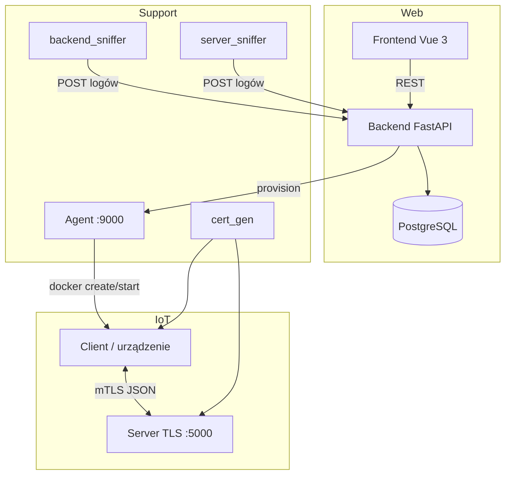

# Architecture

## Przegląd systemu

System składa się z warstwy webowej (frontend + backend), warstwy IoT (server + client) oraz usług wspierających (agent, sniffer, cert_gen).

## Przepływ logowania

1. Użytkownik wysyła `POST /login` z `username` i `passcode`.
2. Backend weryfikuje dane w tabelach `users` i `passwords`.
3. Frontend przechowuje `user_id`, `name`, `privilege_type` w stanie aplikacji.
4. Administratorzy widzą przycisk do panelu admina.

## Przepływ zadań (dashboard)

1. Użytkownik wysyła problem z dashboardu → `POST /tasks`.
2. Backend wybiera pierwsze urządzenie ze statusem `online`.
3. Wpis trafia do `task_logs` ze statusem `pending`.
4. Wynik wykonania (gdy dostępny) jest zapisywany w `task_result_logs`.

**Uwaga:** Kanał server↔client (`send` / `file` w CLI serwera) działa niezależnie od API zadań. Integracja obu ścieżek jest planowanym krokiem rozwojowym.

## Przepływ provisioningu urządzenia

1. Admin klika **Provision Docker Device** → `POST /devices/provision` (backend).
2. Backend przekazuje żądanie do agenta → `POST /provision`.
3. Agent:
   - generuje unikalny `device_id` i certyfikat klienta TLS,
   - tworzy kontener z obrazu `iot-client:latest`,
   - kopiuje certyfikaty do `/certs/` w kontenerze,
   - uruchamia kontener,
   - rejestruje urządzenie w backendzie (`POST /add/devices`).
4. Klient łączy się z serwerem przez TLS i nasłuchuje zadań.

## Protokół server ↔ client

Komunikacja odbywa się po TCP (opcjonalnie TLS z wzajemną weryfikacją certyfikatów). Każda wiadomość to obiekt JSON zakończony znakiem nowej linii.

Typy wiadomości:

| `kind` | Kierunek | Opis |
|--------|----------|------|
| `task` | server → client | Kod Python do wykonania |
| `result` | client → server | stdout, stderr, exit_code |
| `status` | client → server | Stan urządzenia (CPU, pamięć) |

Pliki: `server/src/protocol.py`, `client/src/protocol.py`.

## Sniffer pakietów

Dwa kontenery sniffera (`backend_sniffer`, `server_sniffer`) używają `network_mode: service:backend/server`, aby widzieć ruch na monitorowanych portach. Przechwycone payloady TCP są wysyłane do `POST /tables/packet_sniffer_logs` i dostępne w panelu admina.

## Bezpieczeństwo

- **Transport IoT:** TLS z `CERT_REQUIRED` — serwer i klient muszą przedstawić ważne certyfikaty.
- **CA:** generowana przez `cert_gen` / `communication/make_certs.py`.
- **Certy per urządzenie:** agent generuje osobny certyfikat klienta przy provisioningu.
- **API webowe:** obecnie bez tokenów sesji — endpointy admina nie wymagają ponownej autoryzacji po stronie serwera (ograniczenie do poprawy w przyszłości).
