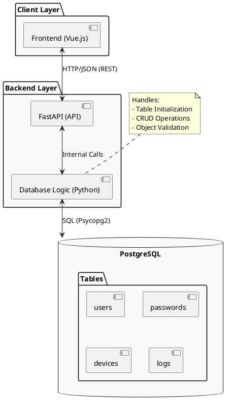

The backend is built with **FastAPI** and integrates directly with a **PostgreSQL** database.

### Core Components
- **FastAPI App**: Provides a RESTful API for managing users, devices, and logs.
- **Database Class**: A wrapper around `psycopg2` that handles connection pooling, table initialization, and CRUD operations.
- **Pydantic Models**: Used for data validation and serialization.

### Data Models
- **User**: ID, Name, Privilege.
- **Password**: User association and hashed passwords.
- **Device**: ID, Status, IP Address.
- **Logs**: Task logs, Task result logs, and HTTP traffic logs.

### API Routes
The backend exposes the following generic endpoints for each supported table:
- `GET /{table}`: Fetch all records.
- `GET /{table}/{id}`: Fetch a specific record by ID.
- `POST /{table}`: Insert a new record (validated via Pydantic).
- `PUT /{table}/{id}`: Update an existing record.

### Security
- **CORS**: Configured to allow requests from the frontend (port 5173).
- **Validation**: Strict schema validation using Pydantic.
- **Environment Config**: Sensitive database credentials are managed via environment variables.

### System Architecture

