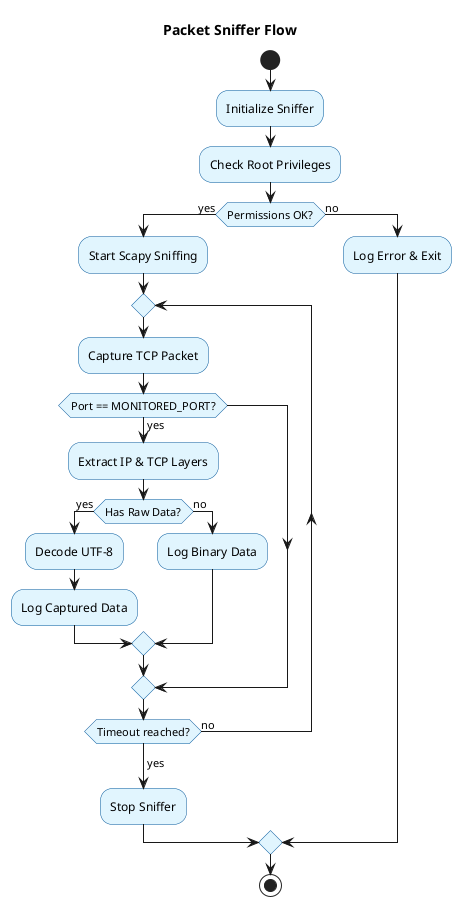

## Packet Sniffer
The packet sniffer is responsible for monitoring network traffic on a specific port and logging relevant data.

### Workflow

### Key Features
- **Scapy Integration**: Uses Scapy for low-level packet capture.
- **Filtering**: Specifically monitors the `MONITORED_PORT`.
- **Decoding**: Attempts to decode payloads as UTF-8 for readability.
- **Logging**: Provides detailed info about captured packets including source/destination IP and ports.
